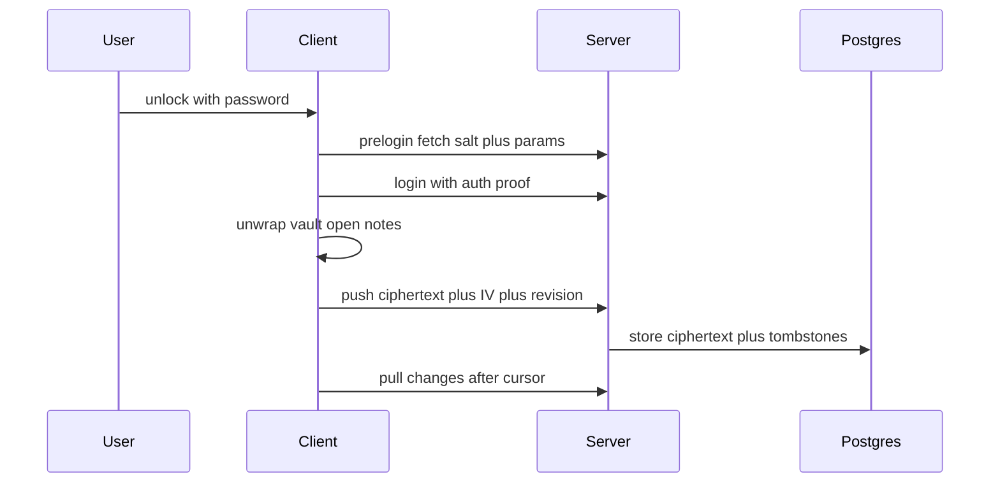

# Architecture

This doc describes Cipherpad structure data flow and sync design as built so far.

## Monorepo layout

```text
cipherpad
  packages/crypto
  packages/server
  packages/client
```

Planned stack uses TypeScript in strict mode everywhere plus pnpm workspaces plus Vite React PWA plus Fastify on Node plus Postgres plus Dexie for IndexedDB plus Vitest plus Playwright plus Docker Compose plus GitHub Actions.

Crypto package stays pure and dependency free and uses browser Web Crypto only. Server package owns auth sessions sync and policy. Client package owns local vault encrypted IndexedDB notes search editor lock behavior and PWA shell with background sync to follow.

## Data flow



UI always reads and writes IndexedDB first. Sync runs in the background and merges by revision with conflict copies kept for user resolution. Deletes use tombstones. Pull returns changes after cursor in order.

## Server schema

Live tables use parameterized queries only. Schema lives in `packages/server/src/schema.sql` and is applied at boot plus in tests.

```sql
CREATE TABLE users ();
CREATE TABLE sessions ();
CREATE TABLE notes (
  id UUID PRIMARY KEY,
  user_id UUID,
  revision INT,
  ciphertext BYTEA,
  iv BYTEA,
  deleted BOOL,
  change_seq BIGSERIAL,
  size INT,
  updated_at TIMESTAMPTZ
);
```

Live auth endpoints:

* `POST /auth/register`
* `POST /auth/prelogin`
* `POST /auth/login`
* `POST /auth/logout`
* `POST /auth/refresh`
* `POST /auth/change_password`
* `GET /auth/me`
* `GET /health`
* `GET /sync/pull`
* `POST /sync/push`

Sync push carries dirty notes with base revision and answers `200` with applied ids or `409` with applied ids plus server versions for stale notes. Sync pull carries opaque changes after the cursor in change order with a next cursor. The client keeps local edits and stores server versions as conflict copies, syncs tombstones as deletions, and merges in the background every `15` seconds plus on reconnect.

Push sends notes with base revision. Mismatch returns conflict with server version for client side merge. Pull is cursor ordered.

## Client plan

Live local behavior:

* Vault create plus unlock plus manual lock with memory clearing
* Encrypted notes in IndexedDB with revision counters plus dirty flags plus tombstones
* Account link plus fresh login with vault adopt and owner reencryption
* In memory search index rebuilt on unlock and after merge
* Background merge with conflict copies kept for user resolution
* Markdown editor with sanitized preview
* Service worker precached shell for offline use

Planned client state:

* Locked state holds no keys and shows lock screen only
* Unlocked state holds non extractable vault plus note keys in memory
* Notes cache lives in IndexedDB in encrypted form with decrypted in memory index for search
* Editor supports Markdown preview with sanitized rendering
* Settings support password change recovery display export and auto lock timeout
* Service worker caches shell for offline use

## Security boundaries

Client plaintext boundary ends at unlock boundary. Server boundary sees ciphertext only. Build boundary is trusted in current phase and moves to signed builds in future work. Memory boundary clears transient raw bytes on lock logout and rotation.
