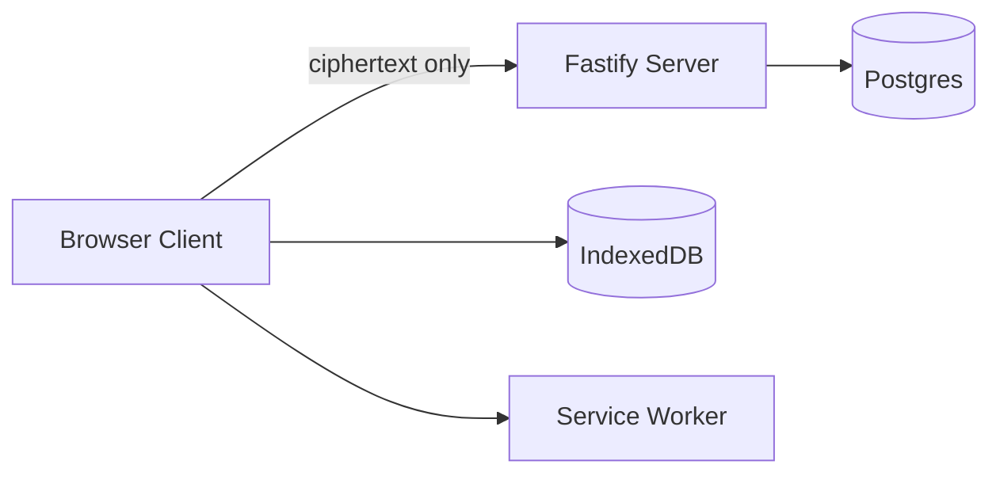
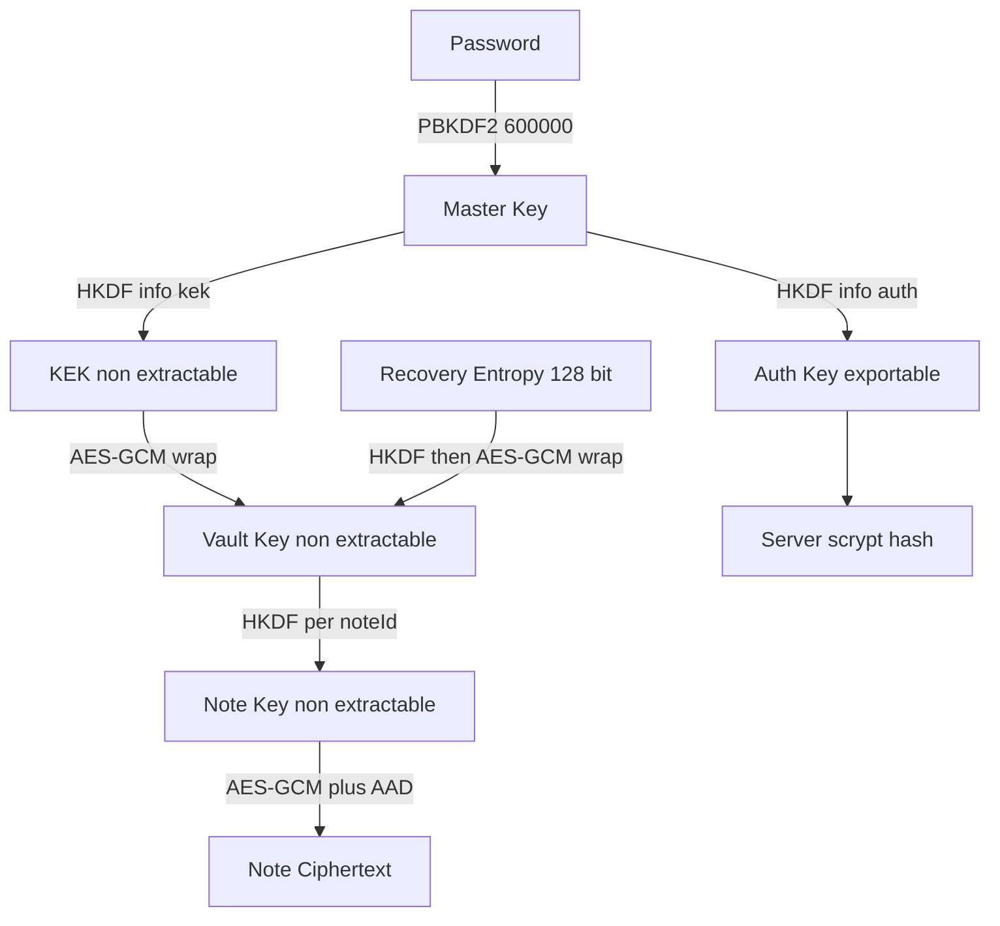

# Cipherpad

I am building Cipherpad to learn applied cryptography by doing. It is a local first end to end encrypted notes app and my portfolio piece for secure API design and sync engineering.

Notes are encrypted in the browser before they leave the device. The server stores and syncs ciphertext only and can never read note content titles or tags.

What I am showcasing: a real key hierarchy using Web Crypto only, a hardened API with Postgres storage, an offline first client with IndexedDB and a PWA shell, and multi device sync with conflict copies, all backed by the honest threat model below.

## Status

Work in progress. Crypto, server auth, offline client, sync, recovery flows, export, auto lock and the zero knowledge database scan are working and tested with CI plus CodeQL plus Dependabot watching the repo.

## Overview

Cipherpad lets one person create edit delete and search notes across devices while keeping plaintext private to unlocked clients.

The UI always reads and writes IndexedDB first and sync runs in the background. Search runs over decrypted notes in memory and is rebuilt on unlock. Export writes decrypted JSON from an unlocked client. Lock clears keys from memory.

Server columns hold no plaintext metadata. Title body tags and timestamps live together inside one encrypted JSON payload.

## Architecture



The client owns all crypto and plaintext. The server owns identity session sync storage and policy. Postgres owns durable ciphertext tombstones and change order. IndexedDB owns offline plaintext cache in encrypted form plus sync cursors. The service worker owns offline shell caching.

Packages in this monorepo:

* `packages/crypto` pure library using browser Web Crypto only
* `packages/server` Node API using Fastify plus Postgres
* `packages/client` Vite React PWA using Dexie for IndexedDB

## Crypto design

Cipherpad uses only browser Web Crypto primitives. No hand rolled crypto and no unmaintained crypto libraries are used.

KDF for registration uses `PBKDF2` with `HMAC` and `SHA-256` at `600000` iterations with a random `16` byte salt. KDF parameters are stored per user so they can be upgraded later.

Master splitting uses `HKDF` with distinct info strings for domain separation. One output is exportable proof material. The other output stays non extractable for wrapping.

Vault wrapping uses `AES-GCM` with `256` bit keys and fresh random `12` byte IV per wrap. Note encryption uses per note keys derived from vault material and note id via `HKDF` then `AES-GCM` with fresh random `12` byte IV per encryption.

Ciphertext is bound to user id note id and revision with AAD so blobs cannot be swapped between notes or rolled back silently.

Recovery uses `128` bit random entropy shown once at signup. Text encoding uses Crockford Base32 with grouping by spaces plus an optional check symbol to catch typos before unwrap.

Password change rewraps vault material only. Notes are not reencrypted.

Unlocked vault and note keys are non extractable objects. Auto lock after idle timeout clears keys from memory on lock and logout.

Login is two steps. Prelogin returns salt and KDF params then login submits proof material. Errors stay generic and comparison stays constant time to avoid user enumeration.

### Key hierarchy



Flow in words:

* Password plus salt derives master material
* Master derives auth proof plus wrapping key with separate info strings
* Wrapping key protects vault material at rest on server
* Recovery entropy protects a second copy of vault material
* Vault material derives each note key by note id
* Each note key protects one JSON payload bound to user note and revision
* Server sees only auth proof wrapped vault blobs and note blobs

### Primitives and parameters

* Password hash: `PBKDF2` `HMAC` `SHA-256` `600000` iterations `16` byte salt `32` byte output
* Master split: `HKDF` `SHA-256` info `cipherpad/auth/v1` for auth info `cipherpad/kek/v1` for wrapping
* Vault: random `32` byte entropy imported as `HKDF` base then wrapped with `AES-GCM` `256` bit IV `12` bytes
* Notes: note key via `HKDF` `SHA-256` info `cipherpad/note/v1/` plus note id then `AES-GCM` `256` bit IV `12` bytes AAD is canonical JSON of purpose user note and revision
* Recovery: `16` byte entropy encoded as `26` data symbols plus `1` check symbol grouped as `9` `9` `9` with spaces
* Recovery auth: `HKDF` `SHA-256` info `cipherpad/recovery/auth/v1` for a `32` byte reset proof with a slow scrypt hash on the server
* Auth transport: `32` byte auth proof encoded as base64url then cleared from memory
* Server verifier: slow scrypt hash of auth proof only

## How to run with Docker Compose

Local run uses Docker Compose for API plus Postgres. Copy `.env.example` to `.env` and set a long random `JWT_SECRET` before starting.

```sh
docker compose up --build
```

Service map:

* API on `http://localhost:3000`
* Client on `http://localhost:5173`
* Postgres on `localhost:5432`

Run checks without Docker:

```sh
pnpm install
pnpm --filter @cipherpad/crypto typecheck
pnpm --filter @cipherpad/crypto test
pnpm --filter @cipherpad/server typecheck
pnpm --filter @cipherpad/server test
```

Server tests use a real Postgres engine in process when no `TEST_DATABASE_URL` is set and use the Compose database when it is set.

## Server auth

Server auth is live in `packages/server`. Register accepts email salt KDF params auth proof and wrapped vault blobs then stores only a slow scrypt hash of the proof plus opaque blobs. Prelogin returns salt and KDF params and returns matching dummy values for unknown mail so accounts cannot be enumerated. Login verifies with constant time comparison and returns generic errors for unknown mail and wrong proof alike. Sessions use a short lived access token in the `Authorization` header plus an opaque refresh token in a strict cookie with rotation on each refresh. Logout clears the cookie and revokes the session. Password change rewraps vault material only then revokes all sessions and issues fresh tokens.

Live endpoints:

* `POST /auth/register`
* `POST /auth/prelogin`
* `POST /auth/login`
* `POST /auth/logout`
* `POST /auth/refresh`
* `POST /auth/change_password`
* `POST /auth/recover`
* `POST /auth/recovery/start`
* `POST /auth/recovery/rotate`
* `GET /auth/me`
* `GET /health`

Hardening in place covers zod validation on every body plus request size limits plus parameterized queries only plus Helmet headers plus strict Content Security Policy with no inline scripts and no third party scripts plus CORS locked to the app origin plus per IP and per account rate limits plus structured logs that never carry tokens keys or ciphertext.

## Client app

Client app is live in `packages/client`. First launch creates a local vault from a password with the same `PBKDF2` params as register then stores salt plus wrapped vault blobs in IndexedDB. Unlock derives and unwraps vault material then decrypts notes into an in memory search index. Lock clears raw material plus index plus selection from memory.

Notes live encrypted in IndexedDB with revision counters and tombstones ready for sync. Search runs over the decrypted in memory index and rebuilds on every unlock. Editor offers Markdown preview with raw HTML blocked plus strict sanitizer config plus safe link schemes only plus no remote images. A service worker precaches the app shell so use continues offline.

Client enforces the crypto package KDF floor on create and unlock, pins params after first trusted setup, and rejects any downgrade.

## Recovery plus settings

Signup generates a recovery key shown once with a written down confirm gate. The key wraps a second vault copy on the server plus a separate auth subkey that authorizes passwordless reset. Forgetting a password on any device runs parse then fetch then unwrap then rewrap then reset, so the same vault material continues without reencrypting notes.

Settings hosts password change by rewrap only, recovery key rotation with show once, plaintext JSON export with an explicit warning, and auto lock timeout with idle listeners plus a persisted choice defaulting to five minutes. Locking clears keys plus index plus selection from memory on manual lock and on idle expiry alike.

## Sync

Sync is live across `packages/server` and `packages/client`. The UI stays local first and a background loop merges every `15` seconds plus on reconnect plus on demand.

Push sends dirty notes with base revision. When the base matches the stored revision the server stores the bundle as is and advances the change order. When the base is stale the server answers `409` with the current server version and applies nothing for that note. Deletes travel as tombstones with bumped revisions so removal propagates to every device.

Pull returns changes after the cursor in change order with a next cursor for paging. The client inserts new rows, overwrites clean rows, ignores echoes of its own writes, and on a dirty row with a newer server version keeps the local edit plus stores the server version as a new note titled with a conflict copy marker for user resolution. Linking a device reencrypts local notes to the account identity and marks them dirty so the server converges on the next push.

Live endpoints:

* `GET /sync/pull`
* `POST /sync/push`
* `GET /auth/vault`
* `POST /auth/recover`
* `POST /auth/recovery/start`
* `POST /auth/recovery/rotate`

Run locally:

```sh
pnpm --filter @cipherpad/client dev
```

## Testing

Unit vectors roundtrip and tamper tests live in `packages/crypto`. Auth integration plus hardening plus recovery tests live in `packages/server`. Vault store search preview sync engine account recovery and auto lock tests live in `packages/client`, plus two device Playwright flows.

* Known vectors for `PBKDF2` `HKDF` and `AES-GCM` cross checked with Node OpenSSL oracle
* Roundtrip for register split vault create note encrypt decrypt recovery wrap and password rewrap
* Tamper tests flip one byte of ciphertext or IV and expect failure
* Binding tests use wrong AAD wrong key wrong user wrong note and wrong revision and expect failure
* Recovery tests validate grouping normalization alias mapping and check symbol mismatch before unwrap
* Server auth tests cover register prelogin login refresh rotation logout password change and session revocation against a real Postgres engine
* Server hardening tests cover Helmet headers strict Content Security Policy cookie flags CORS origin lock rate limits and body size limits
* Client tests cover vault create plus unlock plus lock clearing plus encrypted store roundtrip plus tombstone hiding plus ciphertext only storage plus search plus sanitized preview plus sync engine push pull conflict and tombstone merge plus account recovery wiring plus auto lock timers
* Playwright covers write on A plus read on B plus offline edits with conflict copy plus password change across devices
* Zero knowledge scan registers plus syncs a canary note with production KDF params then asserts the secret appears in no table and no error response
* CI runs typecheck lint tests and audit on every push plus CodeQL plus Dependabot

Run:

```sh
pnpm --filter @cipherpad/crypto test
pnpm --filter @cipherpad/crypto typecheck
pnpm --filter @cipherpad/server test
pnpm --filter @cipherpad/server typecheck
pnpm --filter @cipherpad/client test
pnpm --filter @cipherpad/client typecheck
pnpm --filter @cipherpad/client test:e2e
```

The build is feature complete against the original scope. What remains is ongoing care: dependency updates via Dependabot, audit and CodeQL findings, and independent review.

## Threat model

### Assets

* Note titles bodies tags and timestamps
* Vault material wrapping keys and recovery entropy
* Passwords auth proof and sessions
* Availability of sync and offline access

### Adversaries

* Curious or compromised server that follows protocol but reads stored data or logs
* Network attacker that can read modify or replay traffic
* Thief with stolen database dump including tables and backups
* Thief with stolen device with locked or unlocked client state
* Script injection attacker using XSS in client context

### What is protected

* Server compromise alone reveals no plaintext because server holds ciphertext wrapped vault blobs and verifier hashes only
* Network attacker sees TLS ciphertext plus opaque blobs without keys and cannot forge notes without vault material because AAD authentication fails closed
* Database theft reveals counts sizes timestamps and revisions but no content titles or tags because payloads stay encrypted and keys never leave clients
* Locked device clears keys from memory on lock and requires password or recovery entropy to reopen vault. Clearing is best effort in JavaScript because the collector may retain copies, so lock reduces exposure rather than erasing every trace
* Honest server cannot silently swap blobs between notes or roll back revisions without detection because AAD binds user note and revision

### Out of scope

* Secure endpoint platform browser OS and password manager hygiene
* Physical coercion rubber hose attacks and compelled disclosure
* Traffic analysis resistance and private metadata hiding beyond content encryption
* Malicious insider on client build pipeline beyond signed build plans
* Denial of service and durable backup policy beyond sync tombstones

### Known limitations

* A malicious server can serve altered JavaScript and capture plaintext on next unlock because web crypto trusts served code. Service worker updates arrive through the same channel so a refreshed worker is trusted code delivery from the server too. Mitigation is signed client builds pinned versions and future native or extension packaging. Future work lists signed builds and transparency checks.
* Metadata leaks remain. Note count sizes timestamps and revisions are visible to server for sync order. Mitigation is fixed size padding and batched sync. Future work lists size padding and schedule shaping.
* No forward secrecy for stored notes. Vault compromise exposes history until rotation completes. Mitigation is prompt rotation plus per note reencryption on demand. Future work lists key rotation and versioned rewrap.
* Password strength bounds security. A stolen disk image hands the attacker the wrapped vault plus KDF params, so protection equals password strength times `600000` `PBKDF2` rounds and offline brute force is possible with a weak password. Mitigation is strong KDF params strength meter and recovery entropy option. Future work lists `Argon2id` via `WASM` when audited builds are available.
* Recovery text owns the account. Whoever holds it can reset the password and lock out the owner, so its storage matters as much as password choice. Mitigation is show once handling plus rotation from a live session plus generic reset errors.
* Export is plaintext by design. The downloaded file holds every note readable, so device and backup hygiene decide its safety. Mitigation is an explicit on screen warning plus export only from an unlocked client.
* Clipboard export and preview rendering expand XSS impact if injection occurs. Mitigation is strict Content Security Policy with no inline scripts no third party scripts plus sanitized Markdown preview. Future work lists hardened renderer and privilege separation.

### Mitigations in place

* Only audited Web Crypto primitives with strict TypeScript and dependency free crypto package
* Unique salt per user plus upgradeable KDF params
* Domain separated `HKDF` info strings so auth proof cannot act as wrapping key
* Fresh IV per encryption and authenticated AAD binding
* Non extractable session keys plus explicit memory clearing of transient raw material
* Constant time equality for sensitive comparison and generic auth errors
* Crockford text with alias mapping and check symbol to reduce recovery transcription faults
* Slow scrypt verifier so stolen database rows cannot be turned back into auth proof cheaply
* Dummy prelogin plus generic login errors plus constant time comparison to block user enumeration
* Short lived access tokens plus rotating opaque refresh tokens in strict cookies with server side session revocation
* Rate limits per IP and per account plus zod validation plus parameterized queries plus locked CORS plus secret free logs
* Markdown preview escapes raw HTML then sanitizes through DOMPurify strict config with safe link schemes only and no remote images, with strict Content Security Policy as backstop against injected code calling decrypt
* Local ciphertext only storage plus lock time memory clearing so a locked device reduces exposure of plaintext
* Client side KDF floor plus param pinning so weak counts from the network cannot downgrade vault derivation
* Base revision checks with `409` plus server version so silent overwrites cannot happen and both copies survive for user resolution
* Recovery subkey with separate `HKDF` domain plus slow verifier plus dummy guarded fetch so reset needs the key text and leaks no enrollment signal
* Password change plus recovery rotation rewrap vault material only so notes are never reencrypted and sessions revoke on credential reset
* Auto lock timer with idle listeners plus persisted choice so unattended devices bound plaintext exposure in memory
* Zero knowledge scan registers plus syncs a canary note then asserts the secret appears in no table and no error response

## Deploy notes

I run production shaped deploys with Docker Compose. Copy `.env.example` to `.env` first, then start everything:

```sh
docker compose up --build
```

Checklist before exposing the API:

* Set a long random `JWT_SECRET` unique per deploy, never the example value
* Serve behind TLS and set `COOKIE_SECURE` to true so refresh cookies never travel plaintext
* Keep the Postgres volume backed up because blobs plus tombstones are the sync source of truth
* Set `APP_ORIGIN` to the exact client origin so the CORS lock matches the served frontend
* Run `docker compose up` with restart policy on the host of choice

Known gaps in this setup: compose terminates no TLS itself, runs one API instance with in memory rate limits, and ships no log aggregation. Those fit a portfolio deploy and would change before real users.

### Future work

* `Argon2id` via `WASM` for memory hard KDF
* Note size padding and sync batching to reduce metadata signal
* Vault rotation with background reencryption
* Signed client builds with pinned release verification
* Independent audit and fuzzing of encode decode and AAD paths
